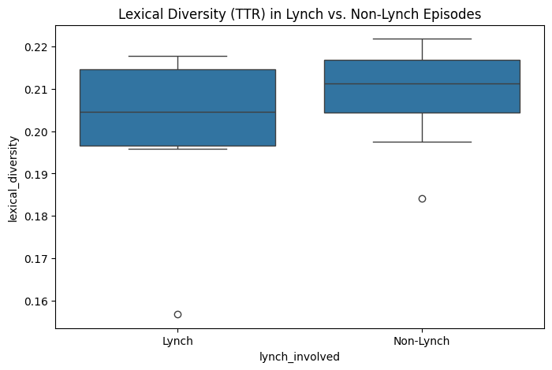
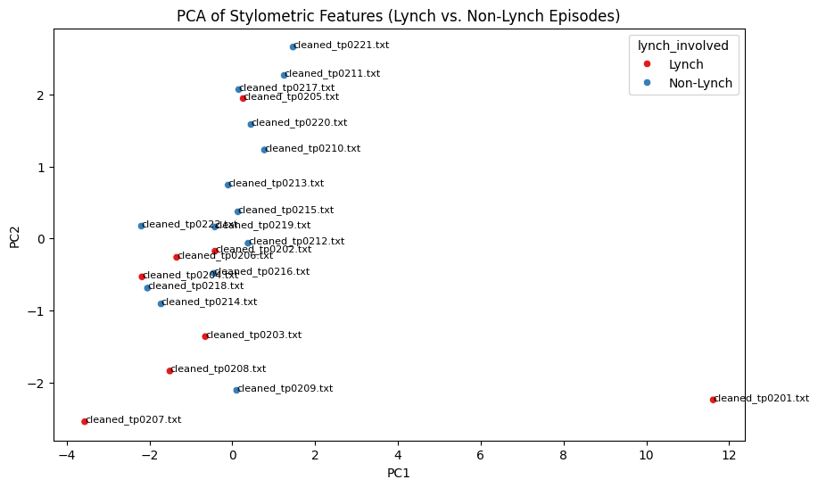

## Project Overview

My goal for my final project was to perform a stylometric analysis of the scripts of *Twin Peaks* season 2 to determine if the episodes widely considered "good" by the fanbase
(episodes 1-8) have any stylistic features that distinguish them from the rest of the season, which is widely considered worse because of David Lynch's lack of involvement. The 
scripts which I used in my analysis are from the Twin Peaks fansite [Glastonberry Grove](https://www.glastonberrygrove.net/texts/).  

## Process

#### 1. Extract Text

Since the scripts I had access to were .pdf files, I used [extract-text.ipynb](extract-text.ipynb) to convert the scripts into .txt files for easier modification and analysis.  

#### 2. Clean Text

After extracting the text, I used [clean-text.ipynb](clean-text.ipynb) to remove features that I thought were irrelevant to the analysis I wanted to perform. I struggled a fair amount
with this step and ended up having to remove the front matter at the beginning of the episodes manually. There are some features in even in the final cleaned versions of the episodes
that I would have ideally liked to get rid of, but they were minor enough that I decided it was better to move on to my next step rather than continuing to refine them.

#### 3. Create CSV

In [extract-stylometric-features](extract-stylometric-features.ipynb) I use the NLTK to extract relavant stylistic features from my cleaned .txt files and store this information in 
a .csv file so I can create data visualizations.

#### 4. Data Visualization

Finally, in [stylometric-analysis.ipynb](stylometric-analysis.ipynb) I assigned the episodes labels according to Lynch's involvement, then created a boxplot of the lexical diversity 
of these two categories of episodes and a PCA of stylometric features to see if there was a visible difference between the two categories of episodes.

## Results and Interpretation

Above are the two graphs I created. Despite some minor differences between the Lynch-involved episodes and the non-Lynch episodes, there is no statistically significant difference
in their lexical diversity nor does the PCA graph produce any clear differentiation between the two groups. The one clear outlier in the PCA graph is episode 1, a Lynch episode. 
I believe this episode stands out because of its longer runtime and thus longer length.  

While my analysis did not find significant difference between the two groups, this does not mean differences do not exist. I only performed a few analyses of many that are possible. 
Additionally, television is a visual medium. This project focused on scripts largely because it was the easiest way for me to access and process data. Other analysis which 
focuses more on visual components of the show may find different results.
